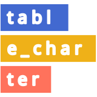

<!-- # table_charter <a href='https://gitlab.com/urswilke/table_charter'></a> -->

# table_charter

[](https://gitlab.com/urswilke/table_charter)

[](https://gitlab.com/urswilke/table_charter/-/commits/main)
[](https://npmjs.com/package/table_charter)

WIP

## Introduction

This javascript package provides a web component `<table-charter>` that hosts an app (using [lit](https://github.com/lit/lit)) which allows to interactively choose the plot type and its settings of the crosstabs generated with the [crosstabser](https://codeberg.org/urswilke/crosstabser) package (for instance, by calling the [`Tabula$save_html_app()`](https://urswilke.codeberg.page/crosstabser/reference/Tabula.html#method-Tabula-save_html_app)). Please open the [demo](https://urswilke.codeberg.page/table_charter/) for an interactive walkthrough and to see it live.

For an interactive demo how table_charter depends on datadaptor & crosstabser see [here](https://urswilke.github.io/datadaptor-crosstabser-table_charter-demo/). See [here](https://urswilke.codeberg.page/crosstabser/articles/data-format.html) for a description of the data format needed by table_charter.

## Installation

If you also want to experiment with the code inside the table_charter web component, install it on your machine with (needs git & npm):

```
git clone https://codeberg.org/urswilke/table_charter
cd table_charter
npm i
```

## Usage

In order to use table_charter you need to load the underlying code into your html. The easiest way is to load the source code of the [npm package](https://www.npmjs.com/package/table_charter) (which you can download from unpkg for every published version) in a stand-alone html file.

### Embedding in html

To understand how you can embed table_charter in html documents, have a look at the [minimal_example.html](minimal_example.html) stand-alone html file. When the source code is loaded, it provides the `TableCharter` web component that contains the app which you can embed with the `<table-charter>` tag in your html.

In [example_dashboard.html](example_dashboard.html) we added a header (with the option to change the language of the app; only English and German for now, but other languages can be easily added with an according json file in [src/languages](src/languages) and adapting [languages.js](src/languages/languages.js)) and a footer and some styling.

### Stand-alone html files

- You can run the app by downloading a stand-alone html file and open it locally in your browser.
- Another way is to install the package on your machine (see above) and then generate a stand-alone file with the current state of all the needed javascript code included (in contrast to providing a download link to the unpkg cdn) running:

```
npm run standalone-build
```

### Dev server

You can run the app on a dev server on your computer with [vite](https://github.com/vitejs/vite) by entering the following in your console:

```
npm run dev
```

This will run the app in `index.html` and all the related source code on a local dev server (`example_dashboard.html` is a stand-alone version of `index.html`).

### Deploying it in the web

Our [demo](https://urswilke.codeberg.page/table_charter/) is the result of deploying the production version of the table_charter html element automatically each time code is pushed into this repo (with the `pages` part in the [woodpecker ci](.woodpecker/woodpecker-ci.yml)). By forking this repo and adapting the data used, you can deploy dashboards with your own data to the web.

### Using quarto

You can embed the app in a quarto document as it's done [here](https://github.com/urswilke/datadaptor-crosstabser-table_charter-demo/blob/main/datadaptor-crosstabser-table_charter-demo.qmd) (the qmd document that creates this [interactive demo](https://urswilke.github.io/datadaptor-crosstabser-table_charter-demo/)) and allows to use [datadaptor](https://codeberg.org/urswilke/datadaptor) and [crosstabser](https://codeberg.org/urswilke/crosstabser) in the same file.

### Embedding in observable notebooks

An example how you can embed table-charter in an observable notebook is shown [here](https://observablehq.com/@urswilke/table-charter).

## Tests

The tests are made with [webdriverio](https://github.com/webdriverio/webdriverio/) and can be run on firefox with

```
npm run test
```

and on chrome with

```
npm run test -- --chrome
```

They are also run on push with the woodpecker ci.

## Outlook

The versatility of the lit element with charts from observable plot and the tidy data structure allow to easily

- add further options to controll the charts' features & appearance,
- connect the dashboard to a data base,
- easily expand the generated plot types, such as
- plotting the data of multiple questions in different columns, or
- assembling the survey data of different years
- etc. ...

## License

Please take note that the source code of this repo is published under the [AGPLv3 license](LICENSE).
